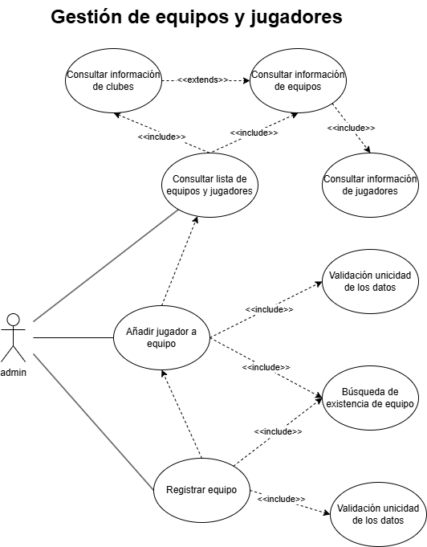
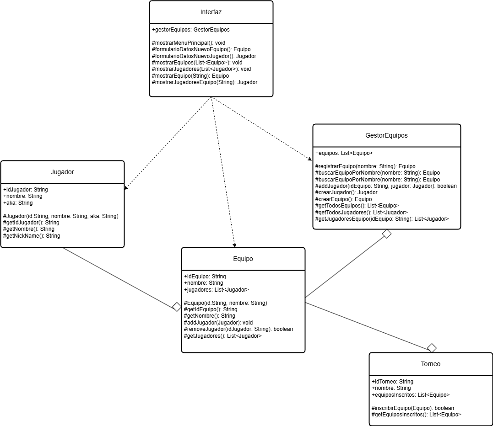

# GestionDeTroneos

## Autor
Manuel Marcote Codesido
ManuelMarcoteC [https://github.com/ManuelMarcoteC]

## Descripción del Proyecto
Link al repositorio del proyecto: [https://github.com/ManuelMarcoteC/GestionDeTroneos]

Este proyecto es el inicio de un sistema de gestión de torneos de eSports en el que se utiliza UML para el modelado. El sistema debe permitir administrar equipos, jugadores, torneos, partidas y resultados.

## Diagramas UML

## Instalación y Ejecución (working in progress...)
1. Clonar el repositorio:
`git clone https://github.com/usuario/torneo-esports-uml.git`
2. Compilar y ejecutar el proyecto:
`cd src javac es/empresa/torneo/Main.java java es.empresa.torneo.Main`

## Justificación del diseño
Se ha optado por una estructura basada en la separación de responsabilidades donde el modelo (modelo/) contiene las clases de entidad (Jugador, Equipo, Torneo, etc.) que representan los datos y la lógica de negocio asociada a ellos. El control o gestiópn de equipos (control/) orquesta las operaciones e interactúa con las entidades. Separa la lógica tanto de la representación de datos y como de la interfaz de usuario. Por su parte la interfaz (vista/) contiene las clases responsables de la interacción con el usuario. Se comunica con el gestor para obtener datos y enviar solicitudes de acciones.

Las relaciones se definieron así:

Agregación para las relaciones Equipo-Jugador, GestorEquipos-Equipo, Torneo-Equipo.

Asociación para Interfaz-Gestión, Interfaz-Modelo, en donde la interfaz usa la gestión para ejecutar acciones y usar las entidades para mostrar datos.

Esta estructura promueve la modularidad, reutilización y mantenibilidad del código.

## Conclusiones
Esta actividad ha permitido poner en práctica los conceptos fundamentales de UML para el modelado de software. El análisis de requisitos junto con la identificación de actores y los casos de uso ayuda a comprender tanto la teoría de modelado como la funcionalidad de un sistema de software desde la perspectiva de un desarrollador y un usuario. La creación del diagrama de clases permite definir la estructura, entidades y relaciones, sirviendo al desarrollo posterior del código. Diferenciar entre clases de Entidad, Control e Interfaz es clave para diseñar un sistema organizado y mantenible, aplicando principios de separación de responsabilidades. El modelado UML es esencial para clarificar el diseño antes de escribir el código.